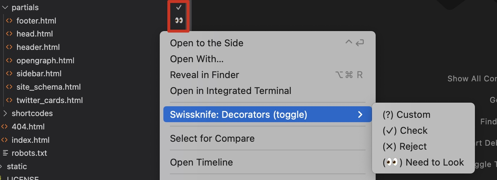
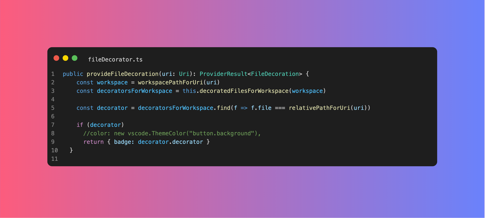

# Swissknife

Available in the [Visual Studio Marketplace](https://marketplace.visualstudio.com/items?itemName=luisfontes19.vscode-swissknife)


Swissknife is the developers' toolbox. It provides a set of features (we call them scripts) to convert data in the editor, like converting to hex, base64 or to generate new data like current timestamps or random strings, etc.

## Main Features

* Multiple generators and converters available in the form of scripts
* Extensible with custom scripts
* Local webserver with request logging
* File Explorer decorators (and custom decorators)
* Generate pretty, framed screenshots of the code
* Right click on a line to copy file relative path with line number ("Copy file path with line")
* Notes/Comments per file line and reporting


## Some of the available scripts
|                                         |                            |                            |
| --------------------------------------- | -------------------------- | -------------------------- |
| Base64 decode                           | Base64 encode              | Binary To Text             |
| Bip39 Mnemonic                          | Capitalize                 | Count characters           |
| Count words                             | CSV to Markdown            | Date to Timestamp          |
| Generate Password                       | Hex decode                 | Hex encode                 |
| Hex to RGB                              | HTML Encode (ALL)          | Identify hash              |
| Join lines                              | JSON to YAML               | JWT Decode                 |
| Local DateTime                          | Lorem Ipsum                | Markdown to HTML           |
| Md5 hash                                | New Swissknife Script (JS) | New Swissknife Script (TS) |
| Password strength                       | Pick random line           | Quoted Printable Decode    |
| Random String                           | Request to fetch           | RGB(a) To Hex              |
| RSA Key pair                            | Self Signed Certificate    | SHA1 hash                  |
| SHA256 hash                             | SHA512 hash                | Sort Lines                 |
| Start Local HTTP Server                 | Start Local HTTPS Server   | Stop HTTP Server           |
| Text To Binary                          | Text to String (Escape)    | Timestamp to Date          |
| To Camel Case                           | To Lower Case              | To Morse code              |
| To Upper Case                           | Unicode decode             | Unicode encode (js format) |
| Unix/Linux Permission To Human Readable | Url Decode                 | Url Encode                 |
| Url Encode (All Characters)             | Url Shorten                | Url Unshorten (url expand) |
| UTC DateTime                            | UUIDv4                     | YAML to JSON               |


## Usage

You can invoke the dedicated command pallete with ```ctrl+shift+9``` for windows or ```cmd+shift+9``` for mac (when focusing the editor)

The conversions will only use the selected text by default. If no text is selected the entire content of the editor will be used.
It supports multi selection and will run the script for each selection individually

### Notes

You can now add notes per line to your code. Since this feature changes a bit the gutter and you start to see a plus sign on the left of the line numbers on the line you hover the mouse, we ship this feature disabled by default and can be enabled per workspace.


Use the command `Swissknife: Enable Notes for workspace` to enable it for the current workspace. From there on you can start adding notes to your code to specific lines as shown in the gif above.

You can also generate a report of all notes in the project by using the command `Swissknife: Generate Notes Report`.

To view the existing notes you'll see a new tab in the bottom pannel called `Comments` where you can find the all the notes created for the workspace

### File Explorer Decorators

You can use decorators to identify files in the explorer. You can create custom decorators and guess what... Emojis are allowed 😁. You can copy them from [here](https://emojipedia.org/).

Due to a limitation in vscode extension system AFAIK I can't allow users to extend the menu with their own decorators, so you always need to go through the "Custom" option to use other decorators.

In the explorer section you'll also have a new section to view all the files decorated with this extension



## Code Screenshot

Just select the code you want to create a screenshot from (or don't select anything and the entire code will be used) and search for the `Code Screenshot` screen.


The filename in the screenshot window is taken from the current file name, and if the file is not saved a temporary name will be used. The file name is editable, so when the right panel appears you can change the name, if you want :)




### Identify Hash

The outcome of the operation may return multiple values, as a hashes from different algorithms have the same output format.
Still we organize the hashes from top down by most relevant.

### HTTP(S) Server

The servers log all requests received into the "Output" window of VSCode (You can show it by going to view -> Output in the menu). Then on the right of the window (where usually has the value "Tasks"), filter by "Swissknife Server"

## Writing Scripts

You can quite easily create your own scripts, without the need to dig through the code of the extension. Just create a file and drop it in the "Scripts" folder.

Check how to do it [here](https://github.com/luisfontes19/vscode-swissknife/blob/master/data/custom_scripts.md)


## Future Plans

* ~~Create unit tests, specially for the scripts~~
* Start doing proper error handlings
* Create a place for user contributed scripts
